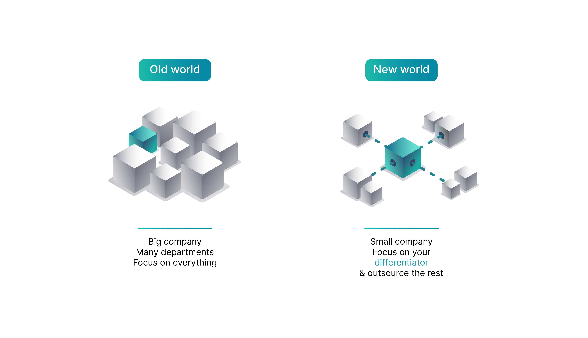

# Feedback for Illustrations

I hired an illustrator on UpWork
to design these illustrations
that better explain the value proposition for GreenDeploy.io

## Analogy

Like how a web framework like Django, or Rails
tie together several open source libraries like postgres, python/ruby
in a single framework

GreenDeploy.io aims to do the same but for commonly used services such as GitHub, etc

| GreenDeploy.io is like a meta framework | Just like Django, Rails are web frameworks |
|--------------------------------------|--------------------|
|Tie together services like GitHub, etc and software like Django | Tie together software like Postgres, Python/Ruby, etc|
|Is opinionated about what tech to use|Is opinionated about what tech to use|
|Quickly build and **deploy a product** as web app|Quickly build a MVC web app|
|Targets **entrepreneurial** engineers|Targets engineers|

## Feedback needed

### 2bv1. illustration 2b with characters side by side

### 2bv2. illustration 2b with characters apart

### 4. old world vs new world target small companies / solopreneurs

